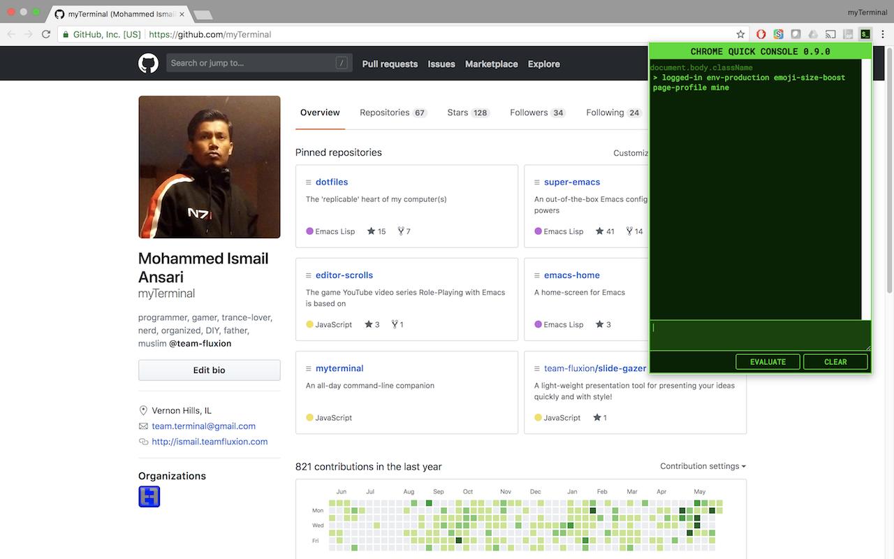

# chrome-quick-console

  

A Google Chrome extension for a developer console outside Developer Tools

You can install it from the [Chrome Web Store](https://chrome.google.com/webstore/detail/egnpebbaedhmkhdoachibnpiplmkjoke).

## Features

* A developer console outside of Chrome Developer Tools
* Evaluate and run JavaScript while being on the page
* More to come...

## To-do

* Add keyboard shortcuts
* Add customizations
